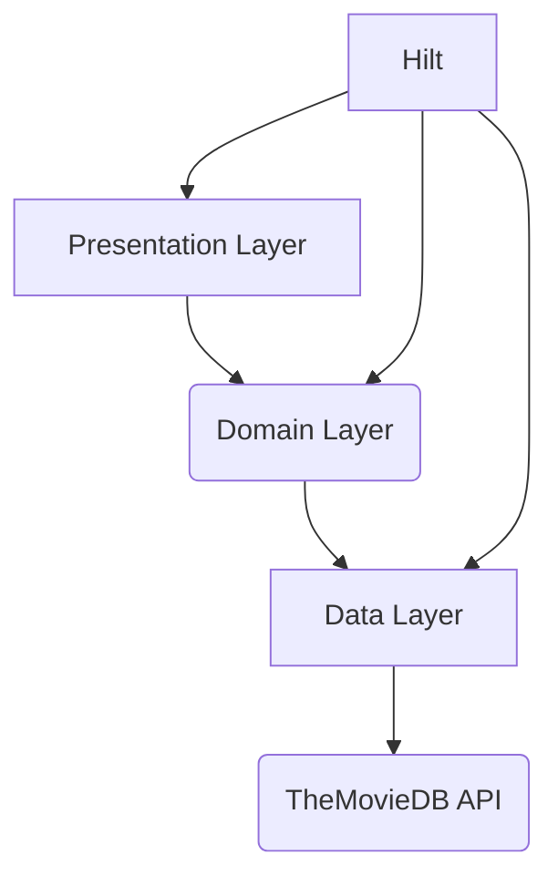

# Movie App Architecture Plan

Based on the initial analysis of the project structure and code, the project appears to be using a layered architecture, likely following Clean Architecture principles with distinct data, domain, and presentation layers, and using Hilt for dependency injection.

## Project Architecture: Clean Architecture

The project seems to follow Clean Architecture, which promotes separation of concerns by dividing the application into distinct layers:

1.  **Presentation Layer:** This layer is responsible for the UI and user interactions. It will display movie data fetched from the domain layer and handle user input. It should not contain any business logic or data fetching code directly.
2.  **Domain Layer:** This is the core of the application and contains the business logic (Use Cases) and interfaces (Repositories, Managers). It is independent of other layers. Use cases will orchestrate the flow of data to achieve specific application features (e.g., getting a list of popular movies). Interfaces defined here will be implemented in the data layer.
3.  **Data Layer:** This layer is responsible for fetching data from external sources (like TheMovieDB API) and implementing the interfaces defined in the domain layer. It converts data from external sources into a format usable by the domain layer.

## Role of Hilt:

Hilt is used for dependency injection, which helps manage the dependencies between different components and layers of the application. This makes the code more testable, maintainable, and scalable.

## Integrating TheMovieDB API and UI Design:

The integration of TheMovieDB API and the UI design inspired by the provided GitHub links will fit into this architecture as follows:

- **Data Layer:** This layer will contain the implementation for fetching data from TheMovieDB API. This will involve setting up API calls, handling responses, and potentially caching data.
- **Domain Layer:** This layer will define use cases for various movie-related operations (e.g., `GetPopularMoviesUseCase`, `SearchMoviesUseCase`). These use cases will depend on the repository interfaces defined in the domain layer.
- **Presentation Layer:** This layer will consume the use cases from the domain layer to display movie data in the UI, following the design patterns from the inspiration projects.
- **Set up Dependency Injection with Hilt:**
  - Configure Hilt modules to provide instances of repositories and use cases to the presentation layer.

## Detailed Plan Steps:

1.  **Define Domain Layer Interfaces:**

    - Create interfaces in the `domain` layer for data repositories (e.g., `MovieRepository`) that define the operations needed (e.g., `getPopularMovies()`, `searchMovies(query: String)`).
    - Define data models in the `domain` layer that represent the core business entities (e.g., `Movie`).

2.  **Implement Data Layer:**

    - Implement the repository interfaces defined in the domain layer (e.g., `MovieRepositoryImpl` in the `data` layer).
    - Set up the necessary components for interacting with TheMovieDB API (e.g., Retrofit for network calls).
    - Implement the data fetching logic within `MovieRepositoryImpl`, converting API responses to the domain models.

3.  **Create Domain Layer Use Cases:**

    - Create use case classes in the `domain` layer (e.g., `GetPopularMoviesUseCase`, `SearchMoviesUseCase`).
    - These use cases will depend on the repository interfaces defined in the domain layer.
    - Implement the business logic within the use cases, orchestrating calls to the repositories.

4.  **Develop Presentation Layer (UI):**

    - Design and implement the UI components based on the inspiration projects.
    - Use ViewModels (or similar architectural components) in the presentation layer to interact with the use cases from the domain layer.
    - Observe data from the ViewModels and display it in the UI.
    - Handle user interactions and trigger appropriate use cases.

5.  **Implement Git Workflow:**
    - For each feature or task (e.g., displaying popular movies, implementing search), create a new branch.
    - Make focused commits that describe specific functional changes.
    - Follow a standard pull request process for merging changes.

## Mermaid Diagram:

**Explanation of Diagram:**

- The Presentation Layer depends on the Domain Layer to get data and trigger actions.
- The Domain Layer depends on interfaces implemented by the Data Layer.
- The Data Layer depends on external sources like TheMovieDB API.
- Hilt is used to inject dependencies across the layers.
